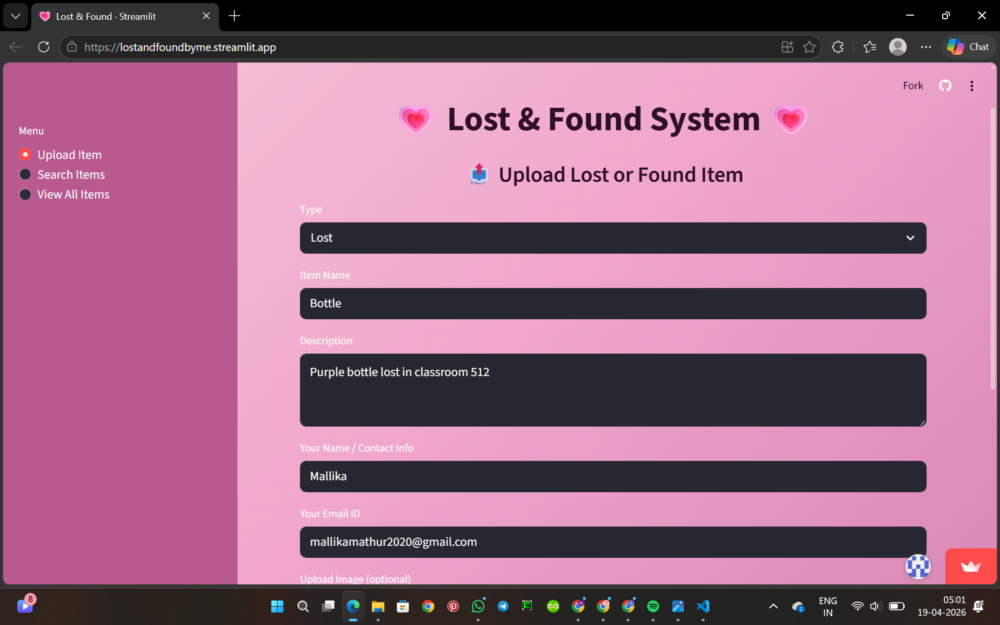
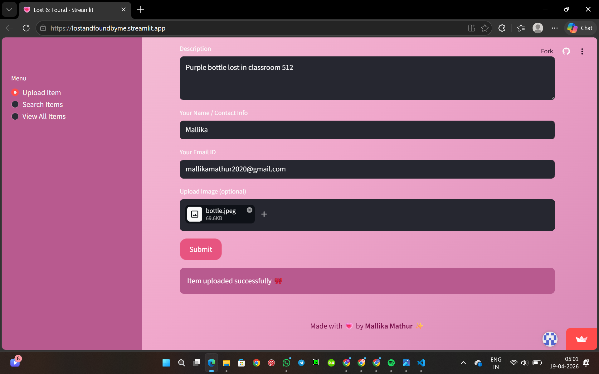
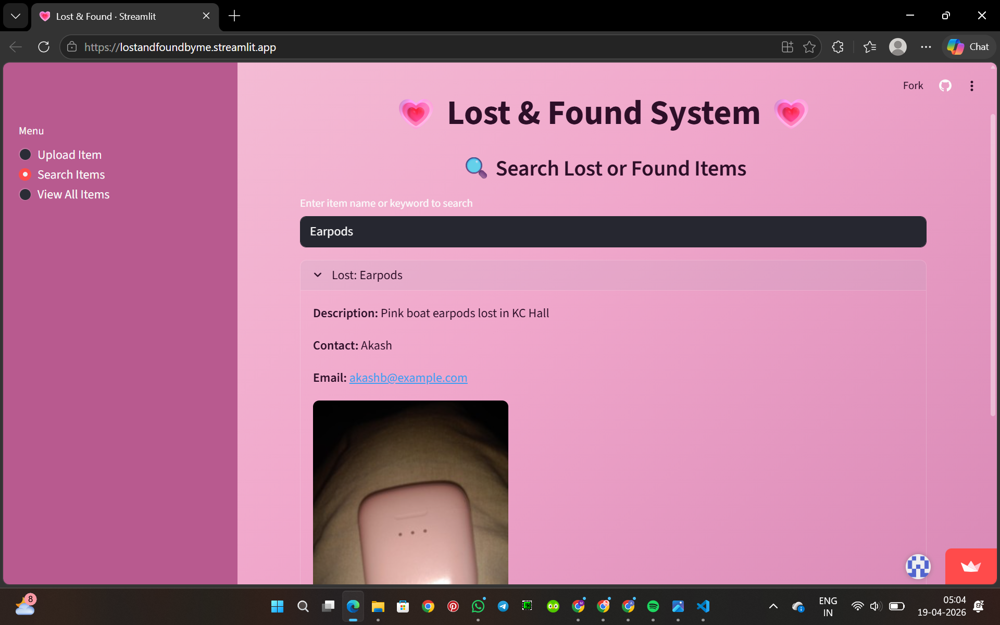
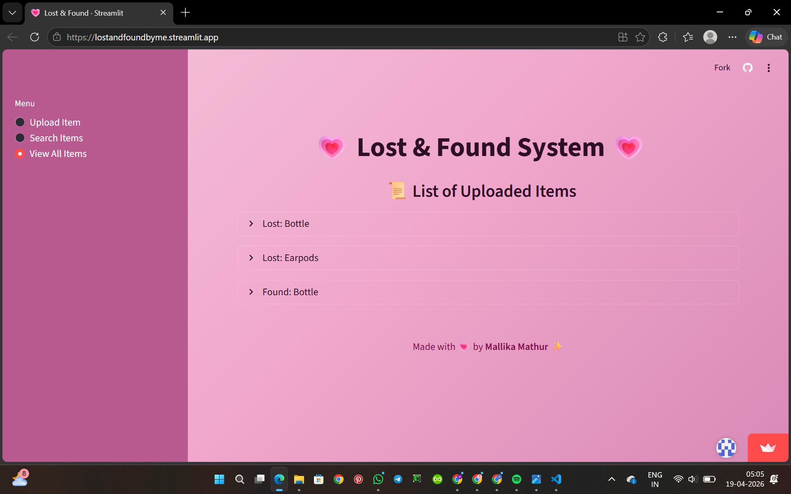
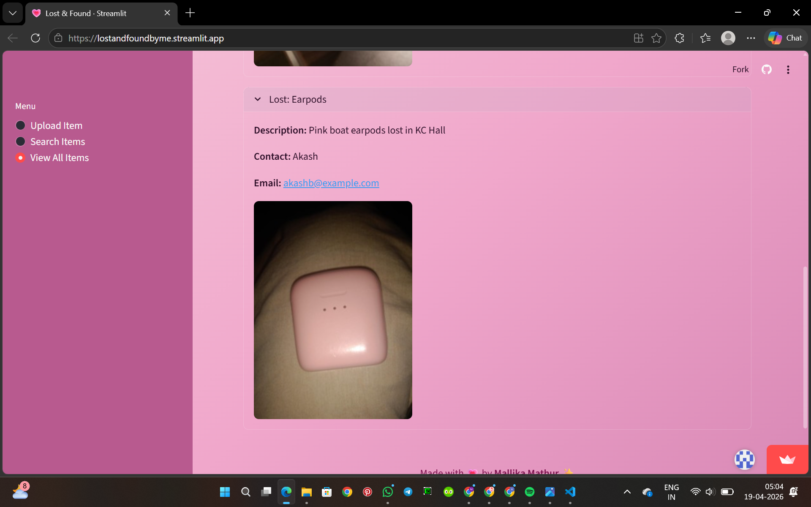
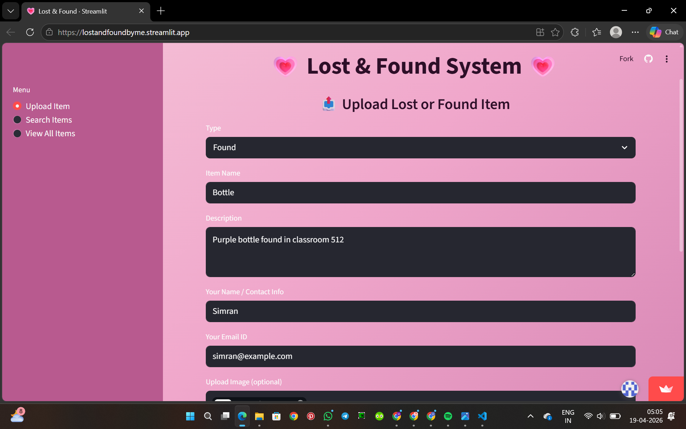
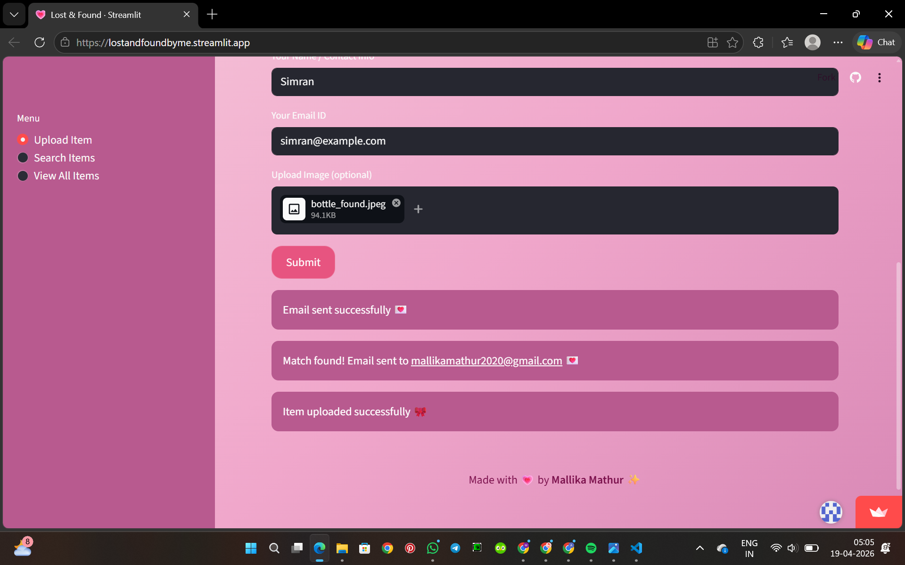
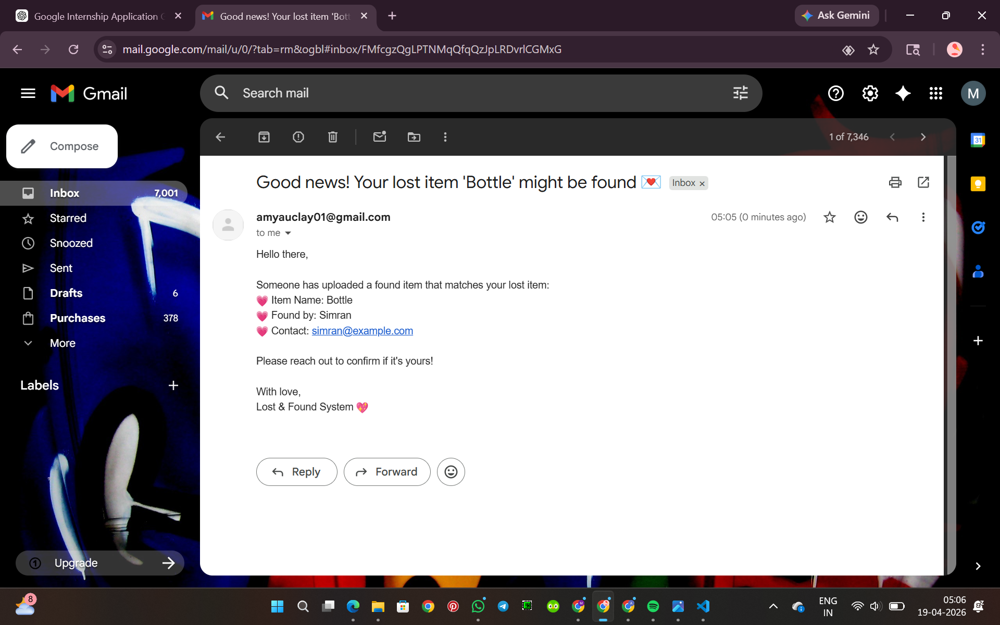

# Lost & Found System

A web application built using Streamlit to help users report, search, and match lost and found items. The system also includes an automated email notification feature that alerts users when a potential match is found.

---

## Live Demo

https://lostandfoundbyme.streamlit.app/

---

## Features

* Upload lost or found items with details and images
* Search items using keywords
* View all uploaded items in an organized list
* Automatic matching of lost and found items
* Email notification system for possible matches
* Image support for better identification

---

## Tech Stack

* Python
* Streamlit
* Pandas
* Pillow (Image handling)
* SMTP (Email automation)

---

## Application Screenshots

### Upload Lost Item



---

### Upload Success



---

### Search and Results



---

### View All Items



---

### Item Details



---

### Upload Found Item



---

### Email Notification Triggered



---

### Email Received



---

## How to Run Locally

1. Clone the repository:

```bash
git clone https://github.com/m1mallika1/lost-and-found.git
cd lost-and-found
```

2. Install dependencies:

```bash
pip install -r requirements.txt
```

3. Run the application:

```bash
streamlit run app.py
```

---

## Notes

* This project uses CSV-based storage for simplicity
* Data in the deployed app may reset due to cloud environment limitations
* Email functionality requires environment variables for credentials

---

## Project Structure

```
lost-and-found/
│── app.py
│── requirements.txt
│── README.md
│
│── data/
│   └── lost_found_data.csv
│
│── images/
│   ├── upload_lost.png
│   ├── upload_success.png
│   ├── search_results.png
│   ├── view_all.png
│   ├── item_details.png
│   ├── upload_found.png
│   ├── email_sent.png
│   ├── email_received.png
│   ├── bottle.jpg
│   └── earpods.jpg
```

---

## Future Improvements

* Database integration for persistent storage
* User authentication system
* Improved matching using advanced techniques
* UI enhancements for better user experience

---

## Author

Mallika Mathur
